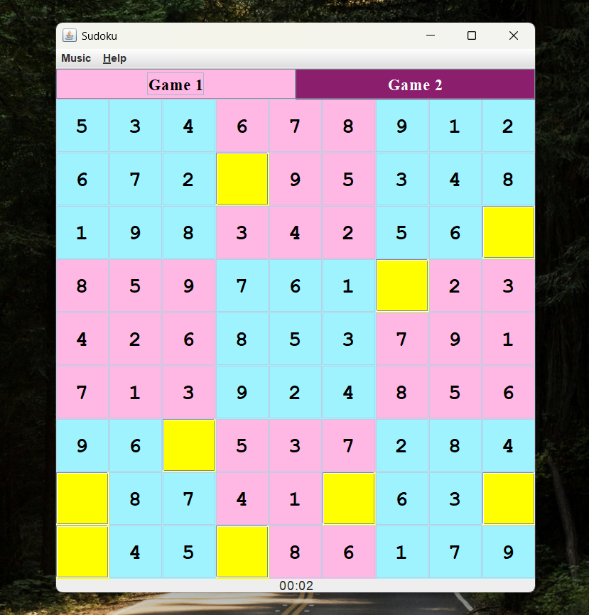

# 🧩 Java Sudoku Game

A desktop-based Sudoku game built with Java Swing, designed with strong object-oriented principles and clean separation of concerns. The application features multiple game modes, real-time validation, background music, and a timer system to enhance user experience.

## 🎥 Demo
▶️ Click to watch a short walkthrough of the gameplay, including puzzle interaction, validation, and completion flow:
[](https://youtu.be/8nav2S8SSgQ)

## 🛠️ Technologies Used

- `Java` (OOP)
- `Java Swing` (GUI)
- `Java Sound API` (Clip)

## ✨ Features

- 🎮 Multiple game modes (Game 1 Easy & Game 2 Medium level)
- 🎲 Randomized puzzle layout for replayability
- 🎵 Background music with toggle control
- ⏱️ Built-in game timer
- 🎉 Completion detection with congratulatory sound
- 🧠 Clear game state management using enums and OOP design

## 📂 Project Structure

```bash
sudoku/
├── SudokuMain.java      // Entry point (runs UI on EDT)
├── MainMenu.java        // Main menu screen
├── SudokuFrame.java     // Main game window (UI + logic coordination)
├── GameBoard.java       // Core game board and logic
├── Puzzle.java          // Puzzle generation and cell hiding logic
├── Cell.java            // Represents each Sudoku cell (value + state)
├── CellStatus.java      // Enum for managing cell states
├── AudioManager.java    // Handles audio loading and playback
```

## 🧠 Key Design Concepts

**Object-Oriented Design**

- Separation of responsibilities across classes (UI, logic, audio)
- Encapsulation of game state using CellStatus enum
- Callback mechanism (setOnPuzzleSolved) for event handling

**Game Logic**

- Sudoku puzzles are predefined and randomized by hiding cells
- Difficulty is controlled by the number of hidden cells
- Each game generates a different layout due to randomization

**Thread Safety (Swing)**

- UI is initialized using:

```bash
SwingUtilities.invokeLater(...)
```

to ensure execution on the Event Dispatch Thread (EDT)

## 🔥 Key Challenges & Solutions

**1. Designing flexible cell state logic (avoiding repeated condition checks)**

- **_Challenge:_** Managing multiple cell states (shown, empty, correct, wrong) without messy `if` conditions everywhere
- **_Solution:_** Introduced `CellStatus` enum with methods like `needsGuess()` and `isSolved()`
- **_Result:_** Cleaner logic, better readability, and centralized state control

**2. Randomizing puzzle difficulty while preserving a valid solution**

- **_Challenge:_** Making each game feel different without breaking Sudoku correctness
- **_Solution:_** Used a complete valid board and randomly hid cells (`numToGuess`)
- **_Result:_** Ensured puzzle validity while adding replayability

**3. Coordinating game completion flow (UI + timer + audio)**

- **_Challenge:_** Detecting when the puzzle is solved and synchronizing multiple components (timer, music, UI)
- **_Solution:_** Used a callback (setOnPuzzleSolved) to trigger: timer stop, music stop, congrats sound, popup
- **_Result:_** Decoupled design with clean event handling

## 📚 Key Learnings

- Applied state-driven design using enums for clean state management
- Improved problem decomposition by separating UI, logic, and events
- Designed event-based workflows using callbacks (game completion handling)
- Used controlled randomness to balance correctness and replayability
- Strengthened debugging of UI, audio, and state interaction issues

## 💻 Running Locally

1. **Clone the repository**

```bash
git clone https://github.com/<your-username>/java-sudoku-game.git
cd java-sudoku-game
```

### ▶️ Using an IDE

2. **Open the project in an IDE (e.g. IntelliJ, Eclipse) and run:**

```bash
SudokuMain.java
```

### ▶️ Using VS Code

Open the project folder in VS Code and use the terminal:

2. **Install:**

- Java Extension Pack (by Microsoft)

3. **Compile all Java files:**

```bash
javac sudoku/*.java
```

4. **Run the program:**

```bash
java sudoku.SudokuMain
```

## 🎮 How to Play

1. Enter numbers (1–9) into empty cells
2. Press Enter to validate input in each cell
3. Click "Help" to read the instructions

## 💡 Future Improvements

- Add difficulty selection (Easy / Medium / Hard)
- Generate puzzles dynamically instead of using predefined boards
- Add hint system
- Improve UI styling and responsiveness
- Save/load game state

## 📌 Notes

- This is a desktop application built using Java Swing and is not deployed as a web app.
- The application runs locally via the JVM.
